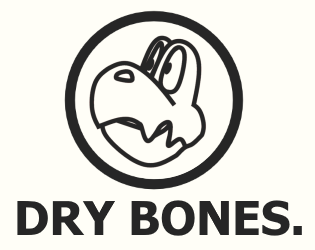
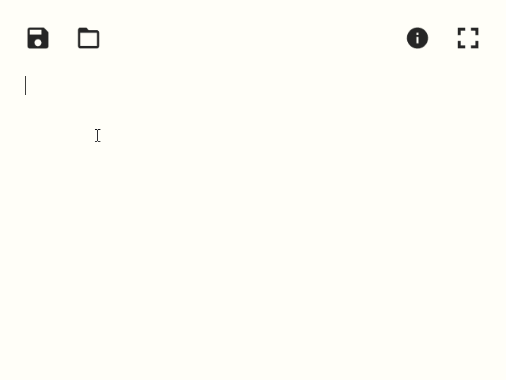

<h1 align="center">
  
   
   
</h1>

<h2 align="center">Minimalist text editor.</h2>
<h5 align="center"><i>Lightweight remake of <a href="https://elgabe.itch.io/paper"><b>PAPER.</b></a></i></h5>

<h1 align="center">
  </a>  
</h1>

## Description

**Dry Bones** is an (almost) featureless text editor.

## Dependencies

- [sciter.dll](https://gitlab.com/sciter-engine/sciter-js-sdk/-/blob/f149f104dcd7fd0db6ca8157acce10f060f03afc/bin/windows/x32/sciter.dll) v4.4.8.38
